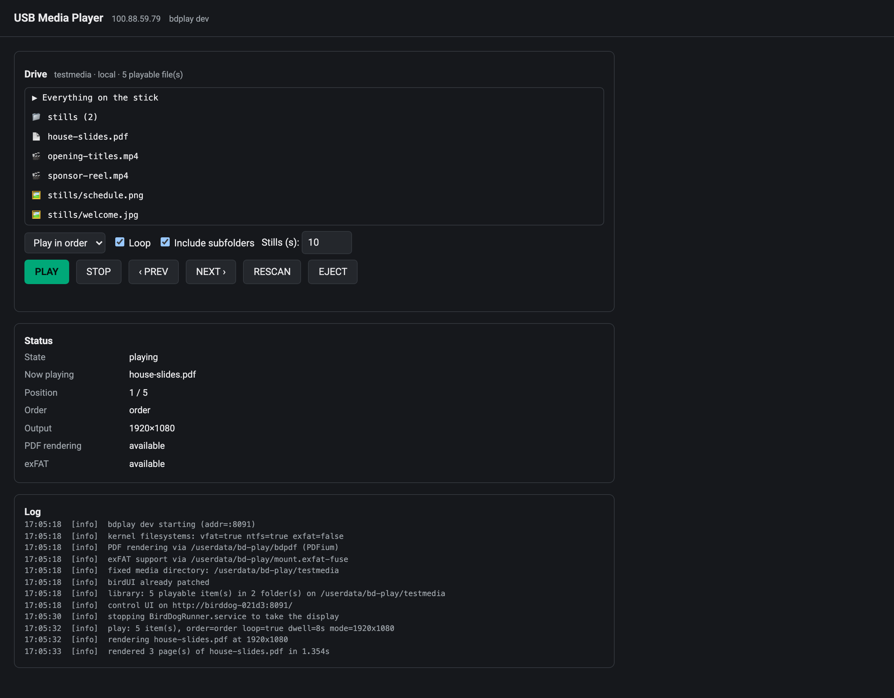
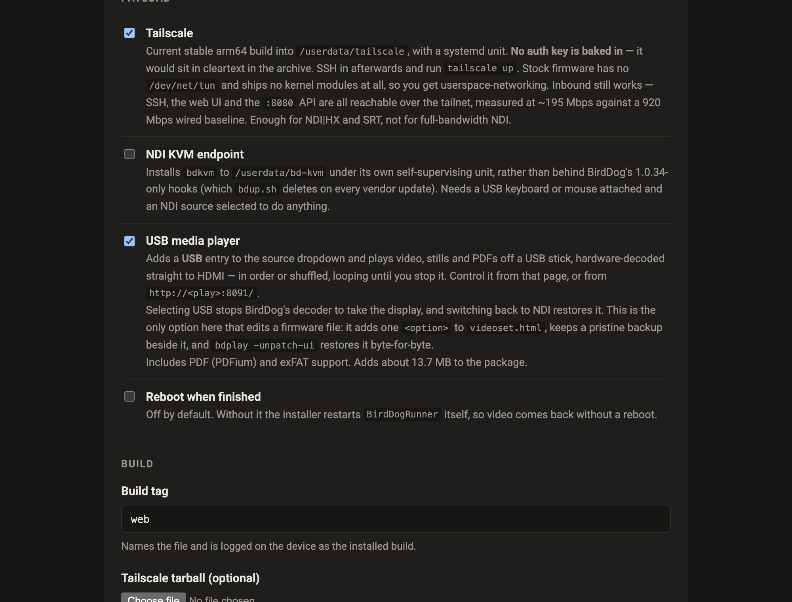
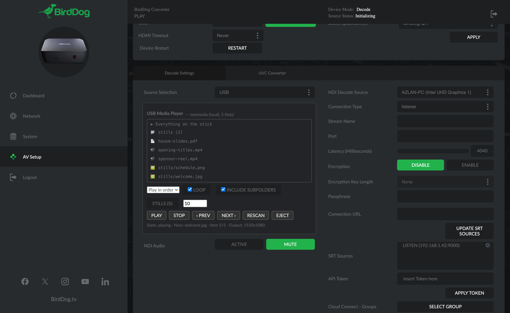

# bdplay — USB media player for the BirdDog PLAY

> **AI-assisted project.** This codebase was created with [Claude Code](https://claude.com/claude-code)
> (Anthropic), directed and reviewed by a human author. The playback path was derived by probing
> the stock firmware, and every claim below was measured on a real BirdDog PLAY (firmware 1.0.30):
> hardware video decode, HDMI audio, stills, PDF rendering, the exFAT mount and the display
> handover with BirdDog's own decoder are all confirmed working on hardware. That is **one unit on
> one firmware version** — it has not been tested across the range of PLAY and Pod firmwares in
> the field, and **USB hotplug with a physical stick is still unverified** (testing used a loop
> device and internal storage).

Adds a **USB** entry to the PLAY's source dropdown and plays video, stills and
PDFs from a USB stick straight out of HDMI — hardware decoded, in order or
shuffled, looping until you stop it.

The PLAY is an NDI/SRT *decoder*: it has no notion of local media. This turns
one into a signage player without giving up anything — select NDI again and the
stock decode path comes straight back.

```
┌──────────────┐   pick "USB"   ┌────────────┐  stop BirdDogRunner  ┌────────┐
│ birdUI :80   │───────────────▶│  bdplay    │─────────────────────▶│ PPApp  │
│ videoset page│  injected JS   │  :8091     │  (take DRM master)   │  dies  │
└──────────────┘                └─────┬──────┘                      └────────┘
                                      │
                        gst-launch-1.0 │ one process per item
                                      ▼
        filesrc → decodebin → mppvideodec → kmssink → HDMI
                              (hardware)              + alsasink hw:1,0
```

## Screenshots

The control page at `http://<play>:8091/`, on a real PLAY mid-playlist — the
library off the drive, the transport, and the log that answers most "why won't
this play" questions:



Installing it needs no toolchain: it is a checkbox in the
[PLAY Patcher](https://birddog-play-patcher.stoatworks-labs.com), which
assembles the firmware package in your browser.



And in place, inside birdUI's own AV Setup page: **USB** selected in BirdDog's
Source Selection, with the picker injected below it. The stock page is
untouched apart from one added `<option>`.



## What it plays

| Type | Formats | How |
|---|---|---|
| Video | mp4, mov, mkv, avi, ts, m2ts, mpg, webm, wmv | `mppvideodec` — hardware H.264/HEVC/VP8/VP9, ~11% of one core at 1080p |
| Stills | jpg, png, bmp, gif, webp, tif | decoded, scaled to the panel with aspect preserved, held for a configurable dwell |
| PDF | pdf | pages pre-rendered to PNG by `bdpdf` (PDFium), then played as stills — 3 pages at 1080p in ~1.3 s |
| Office | pptx, docx, … | **not rendered.** Listed with "export to PDF" rather than silently ignored |

PowerPoint is deliberately out of scope. Rendering it on-device would mean
either LibreOffice (which will not fit or perform on 2 GB and four A53s) or a
partial OOXML renderer that misdraws SmartArt, charts and embedded fonts —
looking broken in exactly the situations where a deck matters. Exporting to PDF
is one step and renders exactly as authored.

## Playback options

- **Selection** — one file, one folder (optionally including subfolders), or the
  whole stick.
- **Order** — as listed (natural sort, so `slide2` precedes `slide10`) or random.
- **Loop** — on by default; content repeats until stopped.
- **Dwell** — how long each still or PDF page holds the screen.

Random reshuffles the whole set each cycle rather than picking independently, so
every file plays once per cycle instead of some repeating while others starve —
and the reshuffle never puts the item that just played at the front of the next
cycle.

## Installing

```bash
./build.sh
scp dist/bdplay-linux-arm64 root@<play>:/userdata/bd-play/bdplay
scp packaging/bd-play.service root@<play>:/etc/systemd/system/
ssh root@<play> 'systemctl daemon-reload && systemctl enable --now bd-play'
```

SSH is on **port 9031** on stock BirdDog firmware. Or build an installable
`.fw` with `birddog-re`'s `tools/fwbuild --with-play` and upload it through the
stock web UI.

On start it patches `videoset.html` to add the USB option. Remove it with:

```bash
/userdata/bd-play/bdplay -unpatch-ui
```

## Using it

Open birdUI, go to the video settings page, and pick **USB** from Source
Selection. A panel appears with the stick's contents. There is also a
standalone control page at `http://<play>:8091/` which additionally shows the
log — use that if the injected panel does not appear.

Everything is drivable from the API, so a Companion button or a cron job works
just as well:

```bash
curl -X POST 'http://<play>:8091/api/play?path=adverts&order=random&loop=1&dwell=8'
curl -X POST 'http://<play>:8091/api/stop'
```

| Endpoint | Does |
|---|---|
| `GET /api/status` | player state, volume, mode, capability flags |
| `GET /api/library` | items and folders on the stick |
| `POST /api/play` | start a selection |
| `POST /api/stop` | stop and hand the display back to BirdDog |
| `POST /api/next` `/api/prev` | skip |
| `POST /api/options` | change order/loop mid-playback |
| `POST /api/rescan` `/api/eject` | storage |
| `GET /api/log` | recent log lines |

## How the dropdown integration works

birdUI's Source Selection lives in `/srv/birddog-web-ui/videoset.html`, a Go
template that `birddog-web-ui` **parses from disk on every request** — verified
on hardware by editing it and seeing the change served with no restart. So the
option can simply be added to the file.

What is *not* possible is teaching the stock handler what USB means: the
compiled Go binary validates `SourceSelection` against its own
NDI/CloudConnect/SRT allowlist, and BirdDog's Express API on :8080 validates
every other field of `/decodesetup` but has no branch for `SourceSelection` at
all. So the patch also injects a script that intercepts the select's change
event, stops the form submitting, and drives bdplay instead.

BirdDog's stored `SourceSelection` is therefore never set to `USB`. The device
stays configured for NDI underneath, which is what makes going back instant and
total. The patch keeps a pristine `videoset.html.bdplay-stock` beside the file
and writes atomically, so a crash mid-write cannot take the web UI down.

## Display handover

There is one DRM master and `PPApp` holds it for as long as it runs, so playing
local media means stopping BirdDog's decode stack:

- `BirdDogRunner.service` is `Restart=always`, so bdplay stops it through
  systemd rather than killing PPApp — killing it just gets it restarted
  underneath you a second later.
- Every exit path restores it: normal stop, SIGTERM, a failed acquire, daemon
  restart. Verified on hardware, including `systemctl restart bd-play`
  mid-playback.

Switching costs a few seconds each way. A unit left with PPApp dead has a dark
output and a working web UI, which reads as bricked — hence the belt and braces.

## Known limits

- **exFAT needs the bundled helper** (`tools/build-exfat.sh`, shipped by
  `--with-play`). The kernel has vfat and ntfs but no exfat and no loadable
  modules — however it *does* have FUSE, so this is a userspace driver and
  needs no kernel or image change. Without the helper, exFAT sticks do not
  mount at all; the status API reports which is the case.
- **~300 ms of black between items.** One GStreamer process per item, because
  the 2020-vintage `rockchipmpp` plugin does not renegotiate caps gracefully
  across a mode change mid-pipeline. Restarting is the robust trade.
- **4K H.264 decodes at 30 fps maximum** (RK3328's ceiling). No 4K60.
- **HEVC and VP9 are hardware-decoded; anything exotic falls back to software**
  on four A53s and will stutter above SD.
- The PLAY locks its HDMI output mode to the first stream it sees, so a mode
  change may need a restart of the decode stack to take effect.

## Licence

bdplay itself is this repo's licence. The two optional helpers it shells out to
are not, and neither is vendored here or built by `build.sh` — build them
deliberately, and resolve the obligations before any public release. Without
either, bdplay runs fine and reports the missing capability rather than failing
oddly.

| Helper | Built by | Licence | Ships from the web patcher? |
|---|---|---|---|
| `bdpdf` + `libpdfium.so` (PDF) | `bdpdf/build.sh` | ours MIT + **PDFium BSD-3-Clause** | **Yes** — permissive, no copyleft, ~7.6 MB |
| `mount.exfat-fuse` | `tools/build-exfat.sh` | fuse-exfat **GPL v2**, libfuse **LGPL v2.1** | **Yes** — source offer met by the public build script; no network clause |
| `mutool` (PDF, alternative) | `tools/build-mutool.sh` | **MuPDF, AGPL v3** | **No** — local `fwbuild` only. §13 reaches network users, and at 37 MB it exceeds Cloudflare's 25 MiB per-file limit anyway |

bdplay only `exec()`s these as separate processes and shares no address space,
so bdplay itself is not a derived work of any of them. Distributing the
binaries inside a `.fw` is what carries the obligation.

PDF uses **PDFium by preference** and falls back to `mutool` only if `bdpdf` is
absent, so a unit that already has mutool keeps working while new installs get
the permissive path. `/api/status` reports which is live as `pdf_backend`.
